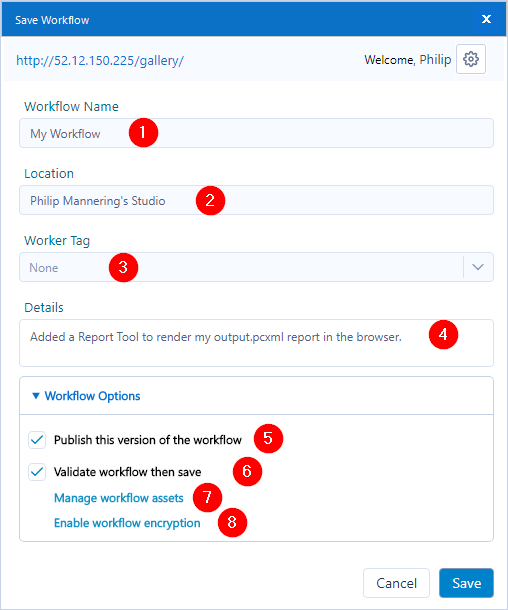
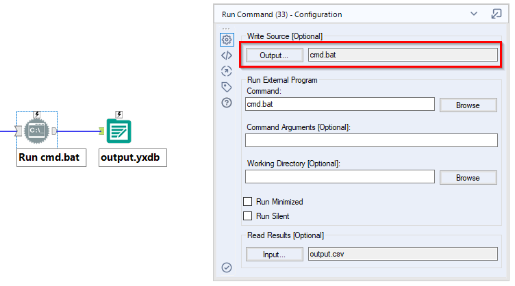

title: The Artisan's Guide to Alteryx Server
summary: A reference guide for Alteryx Designer users looking to find out how best to develop and publish workflows to Alteryx Gallery
keywords: alteryx, server, gallery
category: alteryx
slug: alteryx-server-guide
status: published
tags: reference
date: 2021-07-31
modified: 2021-08-01
author: philip


[TOC]


This is an Artisan's (somebody with permission to publish workflows) guide to Alteryx Server. In particular, how to create workflows that run as expected on Alteryx Server.

There are two primary reasons why you might want to use Alteryx Server,

1. You want to be able to schedule a workflow to run automatically  
2. You want other people (who don't have an Alteryx License) to be able to run a workflow  

In both cases, it's useful to know how certain tools behave on Alteryx Server to get the desired result. This post acts as a reference guide for that purpose.


# Publishing a Workflow 

Once you're ready to save a workflow, you can publish to your Alteryx Server by going to `File > Save As > Private Gallery > My Company's Gallery` (this is not to be confused with `File > Save As > Public Gallery > Alteryx Gallery` which is Alteryx's own public Gallery open to the world). You will then be greeted with this dialog box,



In which,

1. The workflow name - editable when doing a Save As.  
2. The file is always published to your personal Studio. You can choose to share a workflow _after_ it has been published to Gallery.  
3. Worker Tags are used to organize shared workflows into Districts.  
4. Add details to write messages pertaining to the current version (like a git commit message). This is especially important if you plan on regularly changing the published version.  
5. If checked, the current and latest version is made the published version (the version that other people will run). If unchecked, other people will continue to run the old version of the workflow. But you, as an owner, will always run the latest version. This is useful for testing.  
6. If checked, the workflow will run after publishing to inform you if it has worked correctly. Note that there are occasions, for reasons unbeknownst to me, where workflow does throw up errors but still works correctly on Server.  
7. This windows will allow you to package assets (e.g. files and macros) up with the workflow. If an asset is checked and packaged up with the workflow then the Server will always use this copy. This might be fine for a static reference file, but undesirable for a file that is expected to change. If the asset is unchecked then the server will look for a local (to the server environment) copy of that asset. Of course, if one does not exist, or the server does not have permission to access this asset, then this will produce an error. This is perhaps the biggest source of confusion and error for Artisans. **All unpackaged assets must be accessible in the server environment.** And this will not include a file you've saved to your desktop.  

Things to be aware of:  

- The terms *Alteryx Server* and *Alteryx Gallery* are often used interchangeably  
- You have added your company's private gallery so that it's now one of the Save as options  
- Your Server Admin has made you an Artisan (publisher) or Curator (administrator)  
- Your version of Alteryx Designer is *not* newer than the version of Alteryx Server (you can find the version of Server by going to: *My Profile* (top-right) > *Version*)  
- Every time you "Save As" to Gallery, you are creating duplicate workflows with the same name.  


# Tool Behavior on Server
Unfortunately, not everything works on Server as you'd expect. I've done a bit of testing here so you don't have to.


## Inputs

An outline for how the input tools behave on Server is shown below.


| Tool                        | Configuration                     | Manage Workflow Assets | Result                                                                                 |
| --------------------------- | --------------------------------- | ---------------------- | -------------------------------------------------------------------------------------- |
| Input Data                  | C:\Users\Philip\Desktop\input.csv | ☑                      | Runs as expected. But the input.csv file is packaged with the workflow and static.     |
| Input Data                  | C:\Users\Philip\Desktop\input.csv | ☐                      | *Error: Can't find the file*. Alteryx Server has no knowledge of my Desktop!           |
| Input Data with File Browse | C:\Users\Philip\Desktop\input.csv | ☐ or ☑                 | The user can upload their own input file (of any file format)                          |
| Any tool with Folder Browse | -                                 | -                      | *Error: Problem Loading App*. The Folder Browse Tool cannot be used on Alteryx Server. |
| Directory Tool              | C:\Users\Philip\Desktop\input.csv | -                      | *Error: Invalid Directory*                                                             |
| Directory Tool              | C:\                               | -                      | Runs as expected.                                                                      |


In general, the recommendation for,

- **Automating a process** is to write to the full UNC path (e.g. `\\servername\path\to\file.csv`) of a network drive mapped locally *and* on Alteryx Server and when publishing you should have the workflow asset unchecked. If the file does not need to update dynamically (for example a reference file that doesn't change) then the file can be packaged by checking it in *Manage Workflow Assets*.  
- **Allowing the user to select a file** is that any filepath could be used in with a File Browse Tool attached.

## The Python Tool
The Python Tool should work as expected on Server. If you are using Python modules not preinstalled with Alteryx Designer then you'll need to install these modules. I use,

```python
try:
    import <package>
except ModuleNotFoundError:
    Alteryx.installPackage('<package>')
    import <package>
```

This will install the package in the  
`C:\Program Files\Alteryx\bin\Miniconda3\envs\DesignerBaseTools_vEnv\Lib\site-packages\` folder - if not already installed - and then import. Note that the Server must have permission to download files. Speak to your Server Administrator.

## The Run Command Tool
There are two scenarios to consider when publishing a workflow that uses the Run Command Tool,

1. The workflow creates the output batch script (pictured below).  
1. The workflow runs an existing batch script.  



In scenario 1, where you create batch script at run time, you can choose whether or not to package _cmd.bat_. Although, if this changes dynamically then you'll want to have this unchecked in Manage Workflow Assets.  
In scenario 2, where you are running a pre-existing batch script, then you much package the batch script with the workflow to avoid a "system cannot find the file specified" error.

## Outputs

An outline of how the output tools behave on Alteryx Server is shown below. This is true for both *Standard Workflows* and *Analytic Apps*. 

| Tool                   | Configuration                    | Manage Workflow Assets | Result                                                                                                                                                                                                                                     |
| ---------------------- | -------------------------------- | ---------------------- | ------------------------------------------------------------------------------------------------------------------------------------------------------------------------------------------------------------------------------------------ |
| Browse                 | -                                | -                      | No output                                                                                                                                                                                                                                  |
| Output Data            | output.csv                       | ☐ or ☑                 | Option to download output.csv                                                                                                                                                                                                              |
| Output Data            | output.xlsx\|\|\|Sheet1          | ☐ or ☑                 | Option to download output.xlsx                                                                                                                                                                                                             |
| Output Data            | output.yxdb                      | ☐ or ☑                 | Option to download output as a shp, tab, mif, dbf, csv, yxdb or tde. And shows a sample (first 100 records) of the output in the browser                                                                                                   |
| Output Data (multiple) | output1.csv & output2.csv        | ☐ or ☑                 | Option to download each output separately                                                                                                                                                                                                  |
| Output Data            | C:\output.csv                    | ☑                      | Option to download output.csv - i.e. does not save to the C drive on Alteryx Server and will change output location to *_externals\1\output.csv*                                                                                           |
| Output Data            | C:\output.csv                    | ☐                      | Get message: "*This workflow produced no output*". And output.csv is saved to the C drive on Alteryx Server                                                                                                                                |
| Output Data            | C:\Users\Philip\output.csv       | ☑                      | Option to download output.csv - i.e. does not save to the C:\Users\Philip\ folder on Alteryx Server and will change output location to *_externals\1\output.csv*                                                                           |
| Output Data            | C:\Users\Philip\output.csv       | ☐                      | Get error message: *Output Tool - Cannot access folder C:\Users\Philip* - i.e. Alteryx Server cannot save to your local folder unless it is a mapped network drive that has also been mapped on Alteryx Server *and* you use the UNC path. |
| Render                 | -                                | -                      | Behaves the same way as the Output Data Tool unless specified otherwise                                                                                                                                                                    |
| Render                 | Temporary PDF Document           | -                      | No Output                                                                                                                                                                                                                                  |
| Render                 | Temporary Excel 2007 Spreadsheet | -                      | No Output                                                                                                                                                                                                                                  |
| Render                 | Temporary Composer Document      | -                      | No Output                                                                                                                                                                                                                                  |
| Render                 | output.pcxml                     | ☐ or ☑                 | Option to download output as pdf, docx, xlsx, html or zip. And shows a sample (first 100 records) of the report in the browser                                                                                                             |

In general, for maximum flexibility, if you are,  

* __Automating a process__ then you want to write to a full UNC path (e.g. `\\servername\path\to\file.csv`) of a network drive mapped locally *and* on Alteryx Server and when publishing you should have the workflow asset unchecked.  
* __Producing a data file for an end-user__ then write to file as `<filename>.yxdb` in an Output Data Tool. The workflow asset can be checked or unchecked.  
* __Producing a report for an end-user__ then write to file as `<filename>.pcxml` in the Render Tool. The workflow asset can be checked or unchecked.  


# Analytic Apps
The default behavior of input and output tools is the same regardless of whether your workflow is a *Standard Workflow* or *Analytic App*. In Alteryx Designer you can Show the results of say the Browse Tool when an app runs successfully. However, this will have no effect on Server. The main advantage of an App is that you can add user interface for your end-user to modify the configuration of these tools before running. 

Another advantage is that you can chain apps to run one after the other. In `app1` set which app to run second in the Interface Designer. Then make sure this `app2` is packaged as an asset when publishing to the Gallery.


# Versioning

Note that other users will always run Published version of your workflow. However, if you own the workflow, you'll always run the *latest* version of a workflow.

# Conclusion
There's no doubt that Alteryx Server can seem like a black box at times, making it very difficult to diagnose issues. Hopefully this reference makes life a little easier when it comes to sharing workflows with your colleagues.

We have not covered database access and permissions; another source of confusion and frustration, which deserves a post all unto itself.