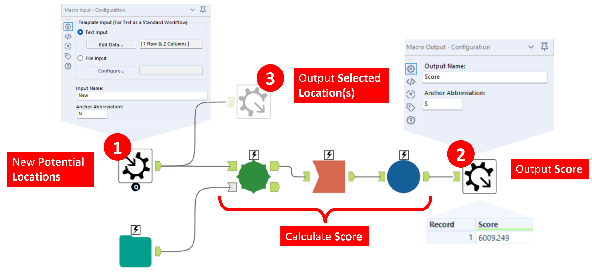

title: Location Optimizer Macros
subtitle: The Oft Forgotten Fourth Type of Macro
summary: Alteryx Location Optimizer Macros can be used to optimize the selection of spatial objects based on criteria set by the user.
status: published
date: 2022-07-18
slug: lom
category: alteryx
tags: [alteryx, optimization, spatial]

# Location Optimizer Macros (LOMs)

There are four types of macros. Though most people can't even remember the name of the elusive fourth type. We have,

1. Standard Macros - to package up several tools into a single tool
2. Batch Macros - to run in a loop for every batch of records in the data
3. Iterative Macros - to run in a loop repeatedly until a condition is met
4. **Location Optimizer Macros**

The textbook definition of the Location Optimizer Macro is:

> A macro that runs over **multiple iterations** to determine the best **suggested locations** to add or remove from a **network** based on a **score**.

<!-- The **network** here just refers to your spatial data.  The **multiple iterations** means that like the Batch and Iterative macros, the LOMs with run multiple times to find a solution. The **suggested locations** are additional spatial data points from which you are selecting from. And the **score** is some final measure - to be minimized or maximized - that's used to determine the best location(s). -->

Where the following definitions apply,

Network
: The network is the spatial data that you are optimizing.

Multiple Iterations
: Like batch and iterative macros, the LOMs run multiple times to find the _best_ solution.

Suggested Locations
: Additional spatial data points to be selected.

Score
: Some final measure - to be minimized or maximized - that's used to determine the best location(s).

## Why are they useful?  

As Location Optimizer Macros are so underutilized, you might well ask what they are for. They are good at finding optimum locations. This could be opening new stores to be closer to your customers, building cell towers that have the greatest coverage, identifying police patrols that are most efficient, or even dividing a region into contiguous areas to apportion workload among sales managers. Any time you're picking locations, there's a potential use case for LOMs. 

If you're trying to find store locations near customers, you might ask why not calculate the distance between stores and customers for _every_ combination of stores. The answer is that this is a computationally expensive task and may take a very long time to run.  

The Location Optimizer Macro uses two phases,

* Phase 1 uses a generic algorithm, it starts with a random guess and keeps the best mutations as the input for Phase 2. 
* Phase 2 then re-balances the set by iterating over small valid changes to each location until the score of the location set has been optimized.  
The Speed/Optimization control determines how long we stay in Phase 1 before completing the optimization in Phase 2.

This means Alteryx LOMs can process larger amounts of data when it comes to deciding locations that might otherwise be unpracticable. 

!!! Info
    The LOM is very similar to the Optimization Tool. In the Optimization Tool you also want to maximize or minimize a score - the result of the objective function - to find the value of decision variables. LOMs, except you are adding points rather than deducing the value of decision variables.

## The Anatomy of a Location Optimizer Macro
Inside the guts of the macro, you will find the following:

A basic example of a Location Optimizer Macro
{.figure}

An LOM requires at least,  

1. A Macro Input Tool for new potential locations  
2. A Macro Output Tool for the score.  
3. An additional Macro Output Tool (optional) is desirable to output the best locations.

Don't forget to set the macro type to *Location Optimizer Macro* in the workflow configuration properties tab.

The Workflow - Configuration tab
{.figure}

The Interface Designer - Properties tab
{.figure}

Once that's done you can set which Macro Input Tool will give you the *Potential Locations Input* and which Macro Output Tool will give you the *Score Output* in the Interface Designer window.

## Using the Location Optimizer Macro

It's surprisingly easy to use the LOM. You just need to feed in a list of potential locations and the algorithm will find the best locations according to the score that you calculated within the logic of the macro.

Using the Location Optimizer Macro in a Standard workflow
{.figure}

The macro configuration options allow you to set how many locations you want to add, the tradeoff between speed and accuracy, and whether you want to want the algorithm to run deterministically (to give you the same result each time) or randomly.

Notice that the required Macro Output Tool (score) gives us a number that is used to find the best location. However, we care very little about the number specifically. It's the second, optional Macro Output Tool (connected directly to the Macro Input Tool) that provides the best location(s) that gives us the answer we're interested in.

## Example: Joe's Bike Shops
Now let's explore LOMs for a specific use case. Joe owns six bike shops. He gets investment to double this. The question we want to answer is:

> *Where should Joe open his new stores?*

First let's define the required data.

**What is the network?**: These are your existing store locations. (This is a fancy term for your current spatial data)  
**Suggested locations?**: The locations of potential new store locations. (You need to provide some viable options)  
**Score?**: In this case, we will go with the total distance between each of your customers and their *nearest* store.  

We also want to specify,

**Do we want to maximize or minimize?**: Minimize (we want to be closer to our customers).  
**How many stores we wish to add?**: 6  

The following illustrates Joe's current bike shop locations,

Joe's existing bike shops.  →  Potential new bike shops.  →  The demand / customers.
{.figure}

### Step 1: Create the Location Optimizer Macro

The macro for Joe's bike shops is similar to the basic example pictured above.

Joe's bike shops macro.
{.figure}

In this example the score is the weighted average of the distance between each customer and their nearest store. And the nearest score may be either a new store _or_ an existing store. This will help get locations near customers that don't already live near an existing store. For instance, it would be completely nonsensical to open a new store across the road from one of Joe's existing stores - calculating the score using all locations prevents this from happening.

Each customer is not equal. They have a weighting that makes some customers more important than others. This is why we don't simply sum the distances, but take the weighted average.

Once we make this a location optimzer macro from the Workflow - Configuration tab and we can set the properties for *Potential Locations Input*, *Score Output*, and *Optimize For a Lower Score* in the Interface Designer. 

### Step 2: Create the workflow

Now it's ready to be used in a workflow. This is trivial. We connect up the data to the macro, set the number of new locations to add to 6 in the macro configuration, and run the macro.

Joe's bike shops workflow.
{.figure .small}

The output is the Score - a number that is used to find the best location but ultimately not useful to us - and the six selected locations.

### Step 3: Results

It really is as simple as that. The macro finds the best locations in accordance with the way we calculate the score. It takes care of running for multiple iterations and spits out the best locations. the results are mapped below,

Joe's suggested new bike shop locations.
{.figure}

!!! Warning
    I have been a bit liberal with the term 'best' when referring to the 'best locations'. As the algorithm starts with a random guess that it improves upon over multiple iterations, the result may not be optimum in the true sense of the word. Two separate runs may yield different results. But you may ensure better results by increasing the number of iterations in the LOM configuration. 

## Conclusion
I started to learn about Location Optimizer Macros when I was working on a project for a client to equally distribute the zip codes the US customers live in into distinct contiguous regions with equal weighting. Not a common use case, but it goes to show how versatile the macro can be with some proper understanding of how it works. I hope this blog at least shows you what the LOM can do and sheds a little bit of light on the oft' forgotten fourth type of macro. Now go _fourth_ and optimize.

<!-- # Notes

## Meeting with Paige
What it does.
I want size more locations and picks the best ones based on a score. Have to specify how many

Use Case 1
Identifying last mile delivery locations. Doing delivery in a city - where do you put them
Ghost kitchens - where would you locate them so that they don't impact your existing restaurants

## Conversation with Tim Raines
### 1. Is it useful, or just a legacy feature of Alteryx?
LOMs are definitely still useful, albeit with more limited use cases than the other three macro types. The implementation in Alteryx is extremely flexible when dealing with spatial data. You can do almost anything within it. It can even be fooled into being a non-spatial genetic algorithm (though I wouldn't recommend it).

It's all about figuring out which 'site' is the best site out of a list of potential sites. The technique itself has a really long history in site location, especially as an academic problem to overcome. I don't know that it's made it very far in general usage yet, though there are some standardized implementations with ESRI which make it a bit easier to do than Alteryx for the lay-user. It tends to be used by very experienced users that are answering a specific niche set of questions. That is, I want to know what the most optimal locations are out of a set of potential locations to satisfy a condition.

### 2. Have you used it in a useful capacity?
The blog post is actually a really abstracted version of a use case that I had, where we were asked "how many distribution centers would we need to serve as much population as possible within 60 minutes" - without knowing where any candidate sites are.

### 3. Do you know any good use cases/examples
There are some really topical examples that are great use cases. Such as, companies wishing to choose the best locations for a new head office that minimize travel distance for their staff. Distribution companies that wish to make sure their centers are minimizing travel distance between them and their delivery points. where is the best location to site a hospital that will minimize the travel distance for the surrounding population most at need?
However, whilst you can do analytically optimize solutions in such use cases, the reality of many of these decisions in business is that you may not be able to secure the optimum site at a cheap enough price, or secure planning permission, and so on. Reality often gets int eh way of the optimum solution. That said, it can help to figure out if you should locate a site in town A vs town B quite well, even if the intricacies cloud the decision of the later point.

### 4. Do you know any good resources from which to learn?
As for the method, there are quite a lot of academic resources for this - google brings up loads. I think I linked in the ESRI training mats in the blog which are also useful.  In Alteryx, the resources are scarce. The Sample workflows are geared toward inclusion within a gravity model problem which makes them a bit confusing to really understand. I don't have Alteryx at work now (AHHHHH), so can't really do a sample workflow easily I'm afraid (though if I can get hold of a trial license for a bit I may be able to).  

A lot of the problems you might want to solve would involve a drivetime/public transport OD matrix, but I think you can fairly easily do a sample using straight line distance, which typically runs much quicker.  As I mentioned, the implementation is via a genetic algo, the basic idea being that it does a quick pass over as many of the candidate locations as possible choosing a subset to evaluate in more detail in the second pass. I think its deterministic if you set the seed, but I've not fully evaluated it - this part is very black box even if your optimization data and params are not!. -->

